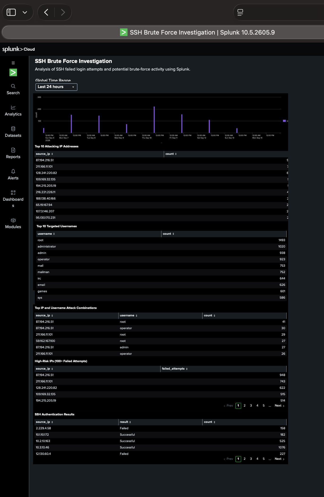

# SSH Brute Force Investigation with Splunk

## Overview
This project demonstrates a security operations investigation of SSH authentication activity using Splunk Cloud. The goal was to identify potential brute-force behavior, determine the most active source IP addresses, identify commonly targeted usernames, and build a dashboard that summarizes the findings for an analyst.

## Skills Demonstrated
- Security log analysis
- Splunk Search Processing Language (SPL)
- SSH authentication analysis
- Brute-force detection
- Regular-expression field extraction with `rex`
- Event aggregation and ranking
- Security dashboard development
- SOC-style investigation and documentation

## Dataset
The investigation used Splunk tutorial security data with the `secure-2` sourcetype. The analysis identified **33,253 failed-password events** in the dataset.

## Investigation
### 1. Identify failed SSH authentication attempts
```spl
source="tutorialdata.zip:*" sourcetype="secure-2" "Failed password"
```

### 2. Identify the most active source IP addresses
```spl
source="tutorialdata.zip:*" sourcetype="secure-2" "Failed password"
| rex "from (?<source_ip>\d+\.\d+\.\d+\.\d+)"
| stats count by source_ip
| sort - count
| head 10
```

### 3. Identify the most frequently targeted usernames
```spl
source="tutorialdata.zip:*" sourcetype="secure-2" "Failed password"
| rex "Failed password for (?:invalid user )?(?<username>\S+)"
| stats count by username
| sort - count
| head 10
```

### 4. Examine attack activity over time
```spl
source="tutorialdata.zip:*" sourcetype="secure-2" "Failed password" "87.194.216.51"
| timechart span=1h count
```

## Key Findings
- **87.194.216.51** generated **948 failed login attempts**, the highest observed source in the investigation.
- **211.166.11.101** generated **743 failed attempts**.
- **128.241.220.82** generated **622 failed attempts**.
- **root** was the most frequently targeted username with **1,493 attempts**.
- **administrator** received **1,020 attempts**.
- **admin** received **938 attempts**.
- **operator** received **923 attempts**.
- Repeated attempts against common privileged usernames are consistent with automated password-guessing/brute-force behavior in this training dataset.

## Investigation Dashboard
The Splunk dashboard below summarizes the SSH brute-force investigation, including attacking IP addresses, targeted usernames, high-risk sources, and authentication results.



> Screenshots in this repository are from a training/lab environment and do not represent a production incident.

## Analyst Recommendations
In a production environment, activity with similar characteristics should be validated against asset and identity context. Potential responses include reviewing successful logins associated with high-volume sources, checking whether targeted accounts are privileged, correlating source IPs with threat intelligence, enforcing MFA where appropriate, applying rate limiting or blocking controls, and creating detection thresholds for repeated authentication failures.

## Portfolio Summary
This project demonstrates my ability to move from raw security events to an analyst-focused investigation: filtering authentication logs, extracting useful fields, aggregating suspicious activity, identifying patterns, and presenting findings in a Splunk security dashboard.

## Repository Structure
```text
ssh-brute-force-investigation/
├── README.md
├── ssh-brute-force.jpg
├── spl/
│   └── investigation-queries.md
└── documentation/
    └── investigation-findings.md
```
